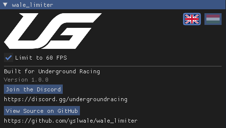

# wale_limiter

Built for the **Underground Racing** server · [discord.gg/undergroundracing](https://discord.gg/undergroundracing)

Locks your game to a smooth **60 FPS**. A simple add-on for [ReShade](https://reshade.me) with
one button - turn it on to cap, turn it off to unlock. The add-on's window speaks **English** and
**Hungarian** - click the 🇬🇧 / 🇭🇺 flag to switch.

## Why 60?

GTA's physics is tied to your frame rate - cars handle differently at different FPS. Capping
everyone to the same 60 keeps racing fair, which is why the cap is a fixed 60 and not a slider.

## ⚠️ Please read first

Made for the **Underground Racing** server, where it's allowed. On **other servers, use it at your
own risk** - every server sets its own rules, and some anticheats may flag add-ons that load into
the game. If you're unsure about a server, ask its staff first.

It needs the **add-on-enabled** build of ReShade - and the download includes it, so you're
covered even if you've never used ReShade. Graphics packs like NVE and QuantV already include
ReShade too.

## How to install

Download **`wale_limiter…zip`** from the
[**Releases page**](https://github.com/yslwale/wale_limiter/releases/latest), extract it,
and open the included **`Install Guide.html`** - it walks you through the whole setup, including the
one-time FiveM "ReShade was blocked" fix. The zip bundles ReShade, so it's all you need.

### Already have another FPS limiter add-on?

Remove it from your `plugins` folder when you drop wale_limiter in. ReShade loads *every*
`.addon64` it finds, so two limiters would each pace the same frame - which caps you at roughly
**30 FPS**, not 60.

## Is it safe? What does it do?

This add-on is **open source**, so anyone can read exactly what it does. It only:

- caps your frame rate to 60 FPS,
- remembers your on/off and language choice,
- shows the logo, an English / Hungarian language switch, the Discord link, and a link to the code.

It has **no ads, no tracking, no internet connection** (the only time it opens your browser is
when *you* click the Discord or GitHub buttons), and it doesn't touch your game's files.

The full source code is right here in this repo, and there's a **View Source on GitHub** button
inside the add-on too.

## Support

Found a bug, or something won't install?
**[Open an issue](https://github.com/yslwale/wale_limiter/issues/new/choose)** - bug
reports and questions are both handled on GitHub, so answers stay searchable for the next person
who hits the same thing.

If the overlay never shows up, attach your **`ReShade.log`** to the issue. It sits next to ReShade
itself (in the same folder as the `.dll` you installed - for FiveM that's
`%LOCALAPPDATA%\FiveM\FiveM.app\plugins`), and the add-on writes to it, so it usually says exactly
what went wrong.

Not on the Underground Racing server yet? The Discord is at <https://discord.gg/undergroundracing> -
that's the place to get onto the server, not the place to report add-on bugs.

## Credits

- **wale_limiter** by **wale**, built for Underground Racing

## For developers

Want to build it yourself or see how it works? See **[BUILDING.md](BUILDING.md)**.
Contributions welcome - start with **[CONTRIBUTING.md](CONTRIBUTING.md)**.

## License

Free and open source under **GPLv3** - see [LICENSE](LICENSE). You can use, study, and modify it,
but any shared version must stay open source too.

The copyright notices of everyone whose code is in this add-on are kept in
[`src/main.cpp`](src/main.cpp), as GPLv3 requires.
